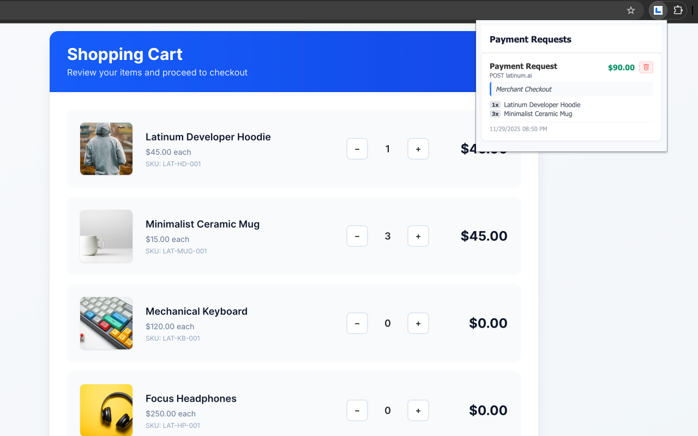
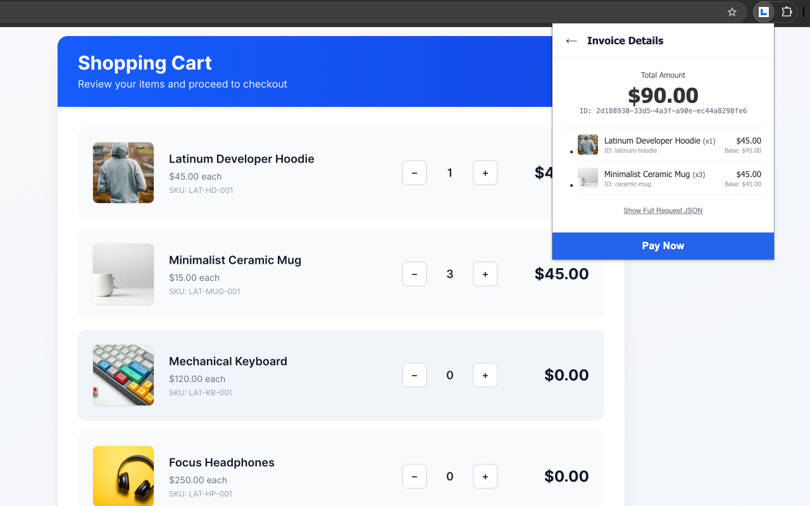

# x402 Browser Capturer (Chrome Extension)

## Overview

This repository demonstrates a **v1‑compliant** x402 implementation (using the `scheme`, `network`, `maxAmountRequired`, `payTo`, and related fields) as a Chrome extension that captures and displays x402 payment requests.

We are already leveraging the core v1 protocol, and as part of our roadmap we plan to adopt **x402 v2**, which introduces an optional `basket` field for a structured representation of multiple line‑items.

- The extension listens for `402` responses, stores the request details, and shows a UI where the user can view the invoice items and click **Pay Now**.

The goal is to provide a **minimal, fully‑functional browser capturer** for x402 payment requests, enabling wallet integration and payment‑gated experiences.

---

## Demo Screenshots

**Extension Popup (Payment Preview)**



**Basket View**



---

## Table of Contents

- [x402 Browser Capturer (Chrome Extension)](#x402-browser-capturer-chrome-extension)
  - [Overview](#overview)
  - [Demo Screenshots](#demo-screenshots)
  - [Table of Contents](#table-of-contents)
  - [Prerequisites](#prerequisites)
  - [Installation](#installation)
  - [Loading the Chrome Extension](#loading-the-chrome-extension)
  - [Using the Extension](#using-the-extension)
    - [Inspecting the data](#inspecting-the-data)
  - [Architecture Overview](#architecture-overview)
    - [Deduplication Mechanism](#deduplication-mechanism)
  - [Key x402 Features Implemented](#key-x402-features-implemented)
  - [Extending / Next Steps](#extending--next-steps)
  - [Proposal for x402 v2](#proposal-for-x402-v2)
    - [Add an optional `basket` field to `PaymentRequirements`](#add-an-optional-basket-field-to-paymentrequirements)
  - [License](#license)

---

## Prerequisites

- **Google Chrome** (or any Chromium-based browser that supports Manifest V3 extensions)
- **Web3 Wallet** (at least one):
  - For Ethereum: MetaMask, Phantom, Coinbase Wallet, or Brave Wallet
  - For Solana: Phantom, Solflare, or Backpack

---

## Installation

```bash
# Clone the repo
git clone https://github.com/your‑username/x402_wpp.git
cd x402_wpp
```

---

## Loading the Chrome Extension

1. Open `chrome://extensions/` in Chrome.
2. Enable **Developer mode** (toggle in the top‑right).
3. Click **Load unpacked** and select the **root folder** of this repository (`x402_wpp`).
4. The extension icon (a small “x402” logo) should appear next to the address bar.

The extension has the following permissions (see `manifest.json`):
- `webRequest` + `extraHeaders` – to capture response headers.
- `storage` – to persist captured requests.
- `scripting` – to inject MetaMask‑related scripts when the user clicks **Pay Now**.
- `notifications` – to show browser notifications when a payment request is captured

---

## Using the Extension

1. Navigate to any website that returns **HTTP 402** responses with x402 payment requirements, such as https://latinum.ai/merchant
2. The extension automatically captures the request and shows a **browser notification**
3. Click the extension icon to view all captured payment requests
4. Click on a request to see the invoice details
5. The extension will show payment buttons for each installed wallet:
   - **Single wallet**: Shows "Pay with [Wallet Name]"
   - **Multiple wallets**: Shows separate buttons for each (e.g., "Pay with MetaMask", "Pay with Phantom (Solana)")
   - **No wallet**: Shows "No Web3 wallet detected. Install MetaMask or Phantom."
6. Click your preferred wallet button to initiate payment
7. The wallet will open automatically to approve the transaction
8. Each request card includes a delete button to remove it from storage

### Inspecting the data
Open the extension popup's DevTools (`Right‑click → Inspect popup`). In the **Console** you can run:
```js
chrome.storage.local.get({requests: []}, ({requests}) => console.log(requests));
```

---

## Architecture Overview

```
+-------------------+        +-------------------+
|   Chrome UI      | <--->  | Background script |
| (popup.html/js)  |        | (webRequest)      |
+-------------------+        +-------------------+
```

- **Background script** (`background.js`) listens for any `402` response, stores the request in `chrome.storage.local`, and shows a browser notification
- **Popup UI** (`popup.html`/`popup.js`) reads the stored requests, parses payment requirements (including `basket` field for x402 v2), and renders invoice items

### Deduplication Mechanism

The capturer implements intelligent deduplication to prevent the same payment request from appearing multiple times:

**Server-side ([server_x402.js:74-88](server_x402.js#L74-L88), [server_x402.js:107-129](server_x402.js#L107-L129)):**
- Generates a unique `paymentId` (UUID v4) for each payment request
- Stores the basket items in an in-memory `pendingPayments` map keyed by `paymentId`
- Returns payment requirements in an `accepts` array structure
- Includes the `paymentId` in `accepts[0].extra.requestId` field

**Client-side ([interceptor_main.js:27-28](interceptor_main.js#L27-L28), [background.js:82-86](background.js#L82-L86)):**
- The interceptor extracts `requestId` from `accepts[0].extra.requestId` in the response body
- The `saveRequest` function deduplicates by matching `requestId`
- When a duplicate is detected, the capturer updates the existing entry

---

## Key x402 Features Implemented

| Feature                    | Implementation                                                                                                |
| -------------------------- | ------------------------------------------------------------------------------------------------------------- |
| **402 Response Detection** | Background script listens for `WWW‑Authenticate: x402` header to recognize x402 payment requests              |
| **Request Storage**        | Captured 402 requests are stored in `chrome.storage.local` for persistence                                    |
| **Basket Support**         | Extension parses and displays x402 v2 `basket` field with line items, quantities, and totals                  |
| **Multi-Wallet Support**   | Detects and displays buttons for all installed wallets (Ethereum and Solana)                                 |
| **Dual-Chain Payments**    | Supports both Ethereum (ERC-20) and Solana (SPL) token transfers                                            |
| **Smart Routing**          | Automatically routes payments based on wallet type and network requirements                                   |
| **Network Management**     | Prompts users to switch networks if needed (e.g., to Base Sepolia)                                          |
| **Request Management**     | Delete button per request to remove entries from storage                                                      |
| **Deduplication**          | Uses `paymentId` to prevent duplicate basket entries when the same payment request is captured multiple times |
| **Browser Notifications**  | Shows desktop notifications when new payment requests are captured                                           |

---

## Payment Integration

### Supported Wallets

**Ethereum/EVM:**
- MetaMask
- Phantom (EVM mode)
- Coinbase Wallet
- Brave Wallet
- Any Web3-compatible wallet

**Solana:**
- Phantom (Solana mode)
- Solflare
- Backpack
- Generic Solana wallets

### How Payments Work

1. **Wallet Detection**: Automatically detects all installed wallets on page load
2. **Multi-Wallet UI**: Shows one "Pay with [Wallet Name]" button per detected wallet
3. **Smart Routing**: Automatically routes payments based on wallet type and network
   - Ethereum payments: ERC-20 token transfers (Base Sepolia, other EVM chains)
   - Solana payments: SPL token transfers (Solana mainnet/devnet)
4. **Network Management**: Automatically prompts users to switch networks if needed
5. **No Alerts**: Silent operation with console logging for debugging

### Payment Flow

**Ethereum (ERC-20):**
- Connects to wallet via `window.ethereum`
- Checks/switches to correct network (Base Sepolia)
- Encodes ERC-20 transfer function
- Sends transaction to USDC token contract

**Solana (SPL):**
- Connects to wallet via `window.solana` or wallet-specific provider
- Creates SPL token transfer instruction
- Signs and sends transaction

## Extending / Next Steps

1. **Enhanced Solana Support** – Integrate full `@solana/web3.js` for production-ready SPL token transfers with proper account derivation
2. **Add UI polish** – dark mode, micro‑animations, toast notifications for payment success/failure
3. **Multi-chain Support** – Add support for more EVM chains (Ethereum mainnet, Polygon, Arbitrum, etc.)
4. **Automated tests** – add integration tests for the extension using Chrome's testing tools
## Proposal for x402 v2

### Add an optional `basket` field to `PaymentRequirements`

**Specification:** The basket field is officially defined in [x402 PR #683](https://github.com/coinbase/x402/pull/683).

**Real-world usage:** This extension demonstrates the basket spec in action. Read about our experience running a live demo: [What did we learn from running the first x402 basket demo?](https://latinumai.substack.com/p/what-did-we-learn-from-running-the)

**Why:** Provides a structured, typed representation of multiple line‑items, eliminating the need for ad‑hoc `extra` objects or custom headers. Improves interoperability, UI consistency, and future‑proofs the protocol for taxes, discounts, and per‑item metadata.

**Schema (JSON‑Schema):**

```json
{
  "$id": "https://x402.org/spec/v2/basket.schema.json",
  "$schema": "http://json-schema.org/draft-07/schema#",
  "title": "Basket",
  "type": "array",
  "items": {
    "type": "object",
    "required": ["name", "price"],
    "properties": {
      "name": { "type": "string" },
      "image_urls": { "type": "array", "items": { "type": "string" }, "description": "Array of product image URLs" },
      "price": { "type": "string", "description": "Amount in the smallest unit of the asset." },
      "quantity": { "type": "integer", "minimum": 1, "default": 1 },
      "tax": { "type": "string" },
      "discount": { "type": "string" },
      "metadata": { "type": "object", "additionalProperties": true }
    },
    "additionalProperties": false
  }
}
```

**Integration steps**

1. Servers include `basket` in the `PaymentRequirements` JSON when they have multiple items.  
2. Clients (e.g., our Chrome extension) read `basket` first; fall back to `extra` or `X‑Invoice‑Items` for legacy support.  
3. The `resource` URL may contain a `paymentId` query‑string for correlation; the basket is stored server‑side for verification.

**Backwards compatibility**

* The field is **optional**; existing implementations that ignore it continue to work.  

---

## License

MIT License

This project supports the x402 v2 basket spec proposal ([PR #683](https://github.com/coinbase/x402/pull/683)).

---

